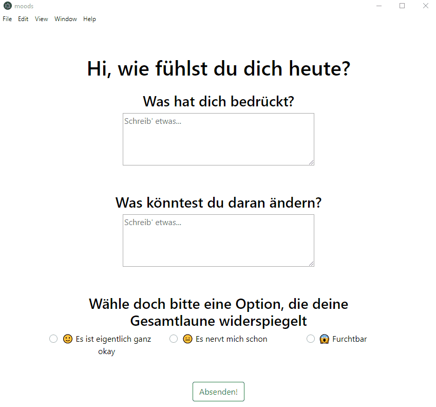

# moods - A simple app build in electron with vue

## currently only in german

### How to use
```
clone rep, open with your favourite editor run yarn electron:serve or 
instead of yarn electron:serve run yarn electron:build
to use this as a desktop app.
```

### demo




